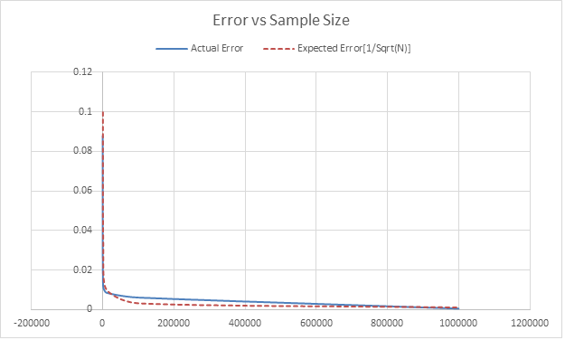

Jervis Muindi   
Numerical Algorithms and Complexity    
February 2013  
Homework 3    

Introduction
============
This project contains code that includes a monte carlo python evaluator. This is used to evaluate the following
integral:

x^2*y + e^(-z) dxdyzdz where the limits of integration are:

x: 0 to 2
y: -1 to 1
z: 1 to 1.5  

I evaluated this integral using  [Wolfram Alpha](http://goo.gl/YM465) and I got a value of 0.578997

How to Run
==========

`$ python montecarlo.py`

A Sample Run
=============
For N = 100, Value is 0.491106. Error = 0.087891
For N = 1000, Value is 0.591232. Error = 0.012235
For N = 10000, Value is 0.570405. Error = 0.008592
For N = 100000, Value is 0.585101. Error = 0.006104
For N = 1000000, Value is 0.578495. Error = 0.000502
 

Discussion
===========
Looking at the results obtained, we see that as N increases, there is a general trend for the error to decrease.

The theory states that this reduction in error should vary according to 1 / Sqrt(N).  

Using the collected data to make a plot of Error Vs # of Samples, We get a plot like this:

From the plot, we see that the rate at which the error decreases follows a 1 / Sqrt(N) trend.  

Thus, the convergence to the right answer also proceeds like 1 / Sqrt(N)

